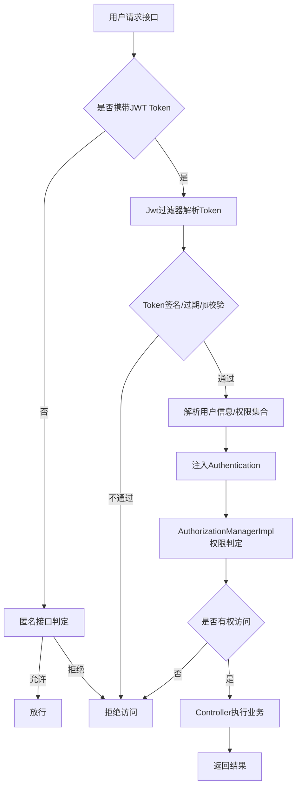

# 🚀 快速开始

欢迎使用 ChainXi-Agent-Doc！

---

<GetLearningMaterial />

**一键部署**：将完整文件夹放在服务器，运行 `./setup.sh`

> 本文档仅简要梳理核心实现，详细代码请参考各模块源码及注释。

---
# ChainXi-Admin 核心技术实现细节

## 1. 模块化架构

- **核心模块**：`chainxi-admin`（业务主模块）、`common-web`（通用基础组件）、`module-om`（监控模块）、`module-generator`（代码生成器）。
- **解耦设计**：各模块职责清晰，便于扩展和维护。
- **多租户与扩展性**：如 `LogicLessBaseDo` 基类，内置多租户字段、自动填充字段，便于扩展。

## 2. 安全与权限管理

- **RBAC 权限模型**：
  - 采用“用户-角色-权限”三级结构，核心表/实体包括：
    - `SysUser`（用户表/实体）：保存用户基本信息。
    - `SysRole`（角色表/实体）：定义系统角色。
    - `SysMenu`（权限/菜单表）：定义系统功能点和菜单。
    - `SysUserRole`（用户-角色关联表）：多对多关系，用户可分配多个角色。
    - `SysRoleMenu`（角色-权限关联表）：多对多关系，角色可分配多个权限。
  - 主要权限判定实现为 `AuthorizationManagerImpl`，其核心逻辑如下：
    - 实现 `AuthorizationManager<RequestAuthorizationContext>` 接口，重写 `check()` 方法。
    - 依赖 `ResourceService` 进行后端接口权限控制，`MenuService` 负责前端菜单权限控制，两者通过菜单-资源的映射实现前后端权限统一。
    - `ResourceService.getResourceRolesMap()` 返回接口与角色/权限的映射，`MenuService` 负责菜单树与权限点的管理，二者通过菜单ID、权限标识等字段建立关联。
    - 典型实现片段：
      ```java
      // 后端接口权限判定
      RequestMappingBo requestMappingBo = resourceService.getResourceRolesMap();
      // 前端菜单权限判定
      List<Menu> menus = menuService.getMenusByRoles(roleIds);
      // 菜单与资源通过权限标识/菜单ID做映射
      ```
    - check() 方法流程：
      1. 判断是否为匿名可访问接口。
      2. 判断是否为登录用户可访问接口。
      3. 获取当前用户权限集合，与当前请求所需权限比对。
      4. 权限点的分配与菜单、资源的映射由 ResourceService/MenuService 联合维护。
    - 典型代码：
      ```java
      @Override
      public AuthorizationDecision check(Supplier<Authentication> supplier, RequestAuthorizationContext authorizationContext) {
          RequestMappingBo requestMappingBo = resourceService.getResourceRolesMap();
          // ...
          // 通过 requestMappingBo.getRegistryAuthority() 获取接口所需权限
          // 与 authentication.getAuthorities() 做比对
      }
      ```

    - 该实现可灵活扩展，支持动态权限、数据权限等高级场景。
  - 典型 Mapper 关联查询（以 `SysUserRoleMapper.xml` 为例）：

    ```xml
    <select id="selectRoleIdsByUserId" resultType="java.lang.Long">
      SELECT role_id 
      FROM sys_user_role 
      WHERE user_id = #{userId}
    </select>
    ```

  - 权限判定流程：
    1. 用户登录后，系统通过 `SysUserRoleMapper` 查询其所有角色。
    2. 再通过 `SysRoleMenuMapper` 查询所有角色对应的权限（菜单/按钮）。
    3. Spring Security 动态加载用户权限集合，注入到 `Authentication`。
    4. `AuthorizationManagerImpl` 在每次请求时动态判定是否有权访问。
    5. 控制器方法可通过 `@PreAuthorize` 注解等方式进行权限校验。
  - 支持数据权限扩展：如按部门、角色动态过滤数据，具体可通过自定义注解+AOP实现数据隔离。
- **Spring Security + JWT**：
  - `SecurityFrameworkUtils` 提供静态方法获取当前登录用户、构建 `Authentication`。
  - `JwtUtil` 封装 JWT 生成、解析、密钥管理，支持自定义加密算法（如 HmacSHA256），如：
    ```java
    public static String createJWT(String subject, Long ttlMillis) { ... }
    public static Claims parseJWT(String jwt) { ... }
    ```
- **动态密钥与防重放**：
  - JWT 密钥支持动态生成与热更新，密钥可存储于配置中心或数据库，支持定期轮换，提升安全性。
  - 典型实现：
    ```java
    public static SecretKey generalKey() {
        byte[] encodedKey = Base64.getDecoder().decode(JwtUtil.JWT_KEY);
        return new SecretKeySpec(encodedKey, 0, encodedKey.length, "HmacSHA256");
    }
    ```
  - 防重放机制：
    - JWT Token 中包含唯一 ID（如 jti 字段）和过期时间，后端可将已用过的 jti 存入 Redis，短时间内拒绝重复使用。
    - 典型流程：
      1. 用户登录，服务端生成带唯一 jti 的 JWT，下发给前端。
      2. 前端每次请求携带 JWT，后端解析 jti 并校验是否已被使用。
      3. 若 jti 已存在于 Redis，则判定为重放攻击，拒绝请求。
      4. 若未存在，则正常处理并将 jti 写入 Redis，设置与 JWT 过期时间一致。
    - 伪代码示例：
      ```java
      String jti = claims.getId();
      if (redisTemplate.hasKey(jti)) {
          throw new BizException("Token 重放");
      }
      redisTemplate.opsForValue().set(jti, "1", tokenExpire, TimeUnit.SECONDS);
      ```
  - 该机制可有效防止 Token 被窃取后的重放攻击，提升系统安全性。
  - 密钥轮换与 Token 失效联动：支持密钥变更后，原有 Token 自动失效，进一步提升安全。
- **接口流量防护**：AOP 切面拦截接口，统计 QPS，便于限流熔断。

### 权限判定与认证流程图（Mermaid）



## 3. 高性能多级缓存

- **多级缓存实现**：
  - `MultiLevelCache` 继承 `AbstractValueAdaptingCache`，实现本地（Caffeine）+远端（Redis）多级缓存，支持同步、过期、主动清理。
  - 典型代码：
    ```java
    public <T> T get(@Nonnull Object key, @Nonnull Callable<T> valueLoader) {
        ValueWrapper result = get(key);
        if (result != null) return (T) result.get();
        synchronized (this) {
            result = get(key);
            if (result != null) return (T) result.get();
            T value = valueLoader.call();
            put(key, value);
            return value;
        }
    }
    ```
- **缓存配置动态同步**：
  - `CacheConfigSynchronizerImpl` 通过数据库表动态同步缓存配置，支持运行时调整过期时间。
  - 典型代码：
    ```java
    public void sync(String name, List<Cache> currentCaches, List<Integer> defaultConfig) {
        SysCacheInfoBo info = getInfo(name);
        List<Integer> expireTimes = info != null 
            ? info.getExpireTimes() 
            : defaultConfig;
        // ...重建缓存实例
    }
    ```
- **序列化与兼容性**：本地缓存弱引用存储，Redis 缓存自定义序列化（如 `KeyPairSerializer`）。

## 4. 数据访问与 ORM

- **MyBatis Plus 封装**：
  - `AbstractWrapper` 封装通用查询条件，支持链式调用、动态 SQL 生成。
  - 典型代码：
    ```java
    public Children in(boolean condition, R column, Collection<?> coll) {
        return maybeDo(condition, () -> 
            appendSqlSegments(columnToSqlSegment(column), IN, inExpression(coll)));
    }
    ```
- **自动填充**：
  - `SysDBFieldHandler`/`DefaultDBFieldHandler` 实现 `MetaObjectHandler`，自动填充 `createTime`、`updateTime`、`updater` 字段。
  - 典型代码：
    ```java
    @Override
    public void insertFill(MetaObject metaObject) {
        LocalDateTime current = LocalDateTime.now();
        this.setFieldValByName("createTime", current, metaObject);
        this.setFieldValByName("updateTime", current, metaObject);
        // ...
    }
    ```

## 5. 监控与可观测性

- **OpenTelemetry 集成**：
  - `PrometheusAspect` 切面采集接口耗时、错误码、异常频率等指标，自动上报至 Prometheus。
  - 典型代码：
    ```java
    @Around("pointCut()")
    public Object around(ProceedingJoinPoint joinPoint) throws Throwable {
        Timer timer = Metrics.timer(
            "pc_reponse_usedtime", "method_name", classMethod);
        Object result = timer.recordCallable(() => joinPoint.proceed());
        // ...异常与错误码统计
        return result;
    }
    ```
- **链路追踪与可视化**：支持 Prometheus + Grafana 可视化监控。

## 6. 代码生成器

- **一键生成**：
  - `module-generator` 基于 Velocity 模板引擎，自动生成 Controller/Service/Mapper/Vue/SQL 等代码。
  - 典型代码：
    ```java
    public static String getTreecode(JSONObject paramsObj) {
        if (paramsObj.containsKey(GenConstants.TREE_CODE)) {
            return StringUtils.toCamelCase(
                paramsObj.getStr(GenConstants.TREE_CODE));
        }
        return StringUtils.EMPTY;
    }
    ```
- **模板定制**：支持自定义模板，灵活扩展生成内容。

## 7. 其他技术细节

- **动态 Bean 注册**：如 `DynamicRegisterUtil`，支持运行时动态注册/注销 Spring Bean。
  ```java
  public static void registerBeanDefinition(String beanName, Class<?> targetClass) {
      ApplicationContext applicationContext = ContextLoader.getCtx();
      DefaultListableBeanFactory defaultListableBeanFactory =
          (DefaultListableBeanFactory) applicationContext.getAutowireCapableBeanFactory();
      BeanDefinitionBuilder beanDefinitionBuilder =
          BeanDefinitionBuilder.genericBeanDefinition(targetClass);
      defaultListableBeanFactory.registerBeanDefinition(
          beanName, beanDefinitionBuilder.getBeanDefinition());
  }
  ```
- **验证码实现**：如 `MathGenerator`，支持数字计算型验证码，提升安全性。
  ```java
  @Override
  public boolean verify(String code, String userInputCode) {
      int result = Integer.parseInt(userInputCode);
      final int calculateResult = (int) Calculator.conversion(code);
      return result == calculateResult;
  }
  ```

---
